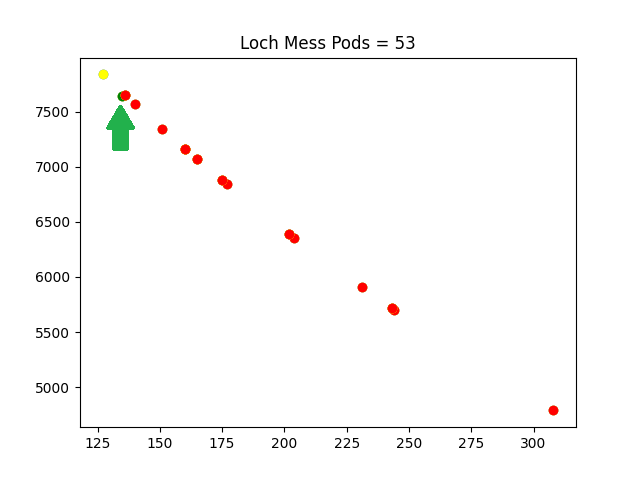

# Summary

To summarize, the basic process was as follows:
- Gather data, either through scraping, or manually going over videos or text.
- Run a formula discovery script on the data, either for a globally applicable formula or per-Infected Zone formulae (e.g. `score_search.py`).
- Visualize the resulting formulae to see if they make sense (e.g. `score_func_plot.py`).
- If the formulae performed well, then see if the coefficients can be optimized further, especially per Infected Zone (e.g `score_torch.py`).
- If not, go back to running a discovery script, or seek different perspectives through basic visualizations and fitting (`viz.py`).
- If you have a profound new perspective, like adding new transformed features or using a different scaling for data points, implement them back in the discovery scripts and go back to running them.
- If no new perspectives come up, identify the data that doesn't fit. Theorize as to why it may not be possible to fit this data.
- Either fix your data (with good reason) or sense check and fix your data collection process.
- Go back to running a discovery script.

This was of course, thought over and repeated for the Fusion Matter formula as well (with `fm_search.py`, `fm_func_plot.py` and `fm_torch.py`). After trying and failing to explain the coefficients discovered for the score formula away (using `param_search.py`), what became a breakthrough was the realization that the coefficients used in the score formula were highly predictive of the Fusion Matter-per-pod averages, which eventually lead to the discovery of the Fusion Matter formula, and supported the above form of the score formula.

# Introduction

The below are the significant points of the discovery process. Some points here needed to be revisited along the way, so the actual discovery process isn't this well-organized, but I've done my best to turn it into a linear story you can follow.

# What was Already Available

- Through the XDT dump of the game, we have the maximum score information per Infected Zone already. These are post-October 5th, 2009 values since the earliest build we have access to is a January 2010 build.
- The number of pods per Infected Zone have been documented in [Universal Guide: FusionFall Retro](https://docs.google.com/document/d/1vpAruFJHH7P9MheRQdu2_wFbrShFYveCLj9l7MLIieA/edit). Since FusionFall Retro is based on the January 2010 build and it did not change the number of pods in Infected Zones, these values can be used.
- We know that the client has constants like `public const float CN_EP_RANK_1 = 0.8f;` which essentially tells us what the rank limits are, with respect to maximum scores. For example, the first rank requires 80% of the maximum score to be achieved. This means that we already have Race Star Formula and Race CRATE Reward Formula, if we also factor in the fact that a floor or truncate operation is more likely to be used for `float` to `int` conversions in C-like languages.
- We also know September 24th, 2009 and October 5th, 2009 have seen the only surviving updates related to racing, thanks to the [Patch Notes Archive](https://docs.google.com/document/d/1LAiB5EQ2NEEWmVKZKGqZN61-SfSbvbmL2HwawoMhZYE/edit#heading=h.lkbrg422r5hm). We know that:
  - September 24th, 2009 update introduced **a change in Fusion Matter rewards** such that they were increased.
  - September 24th, 2009 update introduced **a change in the number of pods** in some races. This likely implicitly implies **maximum score and time limit changes**, and later on, the YouTube findings of races before this update would support this claim.
  - September 24th, 2009 update brought with it the Racing High Scores event, where for 4 weeks, players hitting the weekly leaderboard in at least one Infected Zone received special rewards. [This community post](https://web.archive.org/web/20091203082531/http://www.fusionfall.com/community/event-highscore.php) supports this, and mentions that **all previous scores were cleared**, so that everyone gets a fresh start. Curiously, the page also mentions Taro rewards for races at the time, but there exists no surviving records of Taro rewards as of June 2023.
  - A [Developer's Blog post](https://web.archive.org/web/20100127020248/http://forums.fusionfall.com/thread.jspa?threadID=43897&tstart=0) dated September 21st, 2009 speaks of an upcomping **updated scoring system**, and a new high scores leaderboard system that will be available to players. This refers to the changes that would happen on September 24th, and means that **the score changes were likely a complete overhaul beyond this point** (and not a few simple parameter changes).
  - October 5th, 2009 update appears to be a hotfix update with the new racing scores. It mentions that the **KND Training Area timer has been adjusted to allow for higher scores**, though the "higher scores" effect could be due to a combination of other changes as well. It could also refer to the marginal utility of saving a second in the race being higher.
  - October 5th, 2009 update fixes a roll-over problem of `Inferno Fields` and `Dark Tree Clearing` races. Through scraping, it was seen later on that this error had no effect on surviving scores, possibly due to players renewing their inferior high scores after the fix. This might be due to the `unsigned short` limit of 65535 being involved here, as these two Infected Zones are the only ones with maximum scores exceeding this value. This means that **the racing score formula, whatever it was on September 24th, came with the assumption that the formula couldn't produce negative numbers**.
  - October 5th, 2009 update also introduces **a maximum score increase for an unspecified number of Infected Zones**. KND Training Area seems to have been affected by this as well, as it was common knowledge that the maximum score for this Infected Zone had been changed at some point (which would be later supported by video evidence). The other affected Infected Zones would take a more detailed look at the data found later on, though an exhaustive list is unlikely to be reached with certainty at any point.

# YouTube Search

The YouTube search was done manually, focusing on videos that did not originate from FusionFall Retro and held some sort of reachable information on Infected Zone races. These videos were compiled into [this playlist](https://youtube.com/playlist?list=PLwsvnl43a3vVpo1GSjInndY2-vilTFBop), and then the informtaion in them was put inside a JSON file, which would eventually become (after 3+ rounds of checking and corrections) `score_yt.json`.

Supporting pieces of evidence in each video like information in the description and the "best race in this Infected Zone" card that is visible in racing videos were also used to either generate more data points or to check the validity of what's seen on screen.

The keys used in the objects inside the JSON file were fairly standard:
- `fm`: The Fusion Matter gained through the race (if visible and not cut-off by the existing Fusion Matter for the player). If `og_fm` exists, then this value is constructed later on, this particular data point was not used in the discoveries, and the legitimate value seen on video is `og_fm`.
- `og_fm`: The Fusion Matter gained through the race (if visible and not cut-off by the existing Fusion Matter for the player), specifically for races before September 24th, 2009. This key does not exist in races post-September 24th, 2009.
- `score`: The score achieved through the race. If `og_score` exists, then this value is constructed later on, this particular data point was not used in the discoveries, and the legitimate value seen on video is `og_score`.
- `og_score`: The score achieved through the race, specifically for races before September 24th, 2009. This key does not exist in races post-September 24th, 2009.
- `pods`: The number of pods collected in the race.
- `time`: Total time elapsed in the race.
- `tlim`: The time limit visible on screen throughout the race. If there's a better race of the player at the same Infected Zone, shown through the final screen of the race, the `tlim` of that race is assumed to be the same as the one shown in the video.
- `yt`: Unique YouTube tag. For example, if the value is `fEzZjF4bn4A`, you can find the YouTube video at the link https://youtu.be/fEzZjF4bn4A or https://www.youtube.com/watch?v=fEzZjF4bn4A. The links are valid as of June 2023.

After preparing the list of YouTube scores, a few pieces of key information were collected:
- There is a clear divide between "old" and "new" scores. This is what lead to the discovery that the scoring system was overhauled at some point.
- The time limits of each Infected Zone were found, except 3 of them. There were no data points available for the post-September 24th, 2009 scores for `Pokey Oaks Junior High (F)`, `Mandark's House (F)` or `Loch Mess`. For a long time, the value used for `Pokey Oaks Junior High (F)` was a value inferred from verbal cues of how much time had been left in [an extremely blurry video](https://youtu.be/hNb8R69NaSw), and for the other two, the limits available through videos pre-September 24th, 2009 were used. Certain discoveries in the scraped data would lead to the exact determination of the time limit for `Mandark's House (F)` later on, but the other time limits were never discovered, just inferred (with a good consistency measure). Further, there were some videos with the time limit of `165` seconds for KND Training Area, but newer videos had the limit `150`. Later seen to be reported on in the October 5th, 2009 Patch Notes, this was initially a source of confusion as well.
- Thanks to some videos having Fusion Matter information available, it was noticed that the formula for Fusion Matter could not depend on time, and depended almost linearly to the number of pods collected.

## A Single Anomaly

As these videos are mostly old, some of the numbers in these videos are hard to read. However, most videos with low resolution are readable with some effort.

The only case where a race score recorded in video had to be corrected with expected values later on rather than what's on the screen is [this KND Training Area race](https://www.youtube.com/watch?v=Nimdx71lpz8). The score seen for the race shown in the video seems to read `490` or `493`, and the best race score this player made appears to be `554`, all with 14 pods collected. The issue is that later on, we encounter two race scores with 14 pods, but 1 seconds faster and slower than the one seen on screen, with scores of `472` and `466`, respectively. Further, the score `554` was supported by another race with identical pods and time as the best race. As such, the score shown on screen was recorded as `469` instead.

The rationale is as follows. The older and the better score can be confirmed by other races post-October 5th, 2009, and judging by the Bronze CRATE received, the maximum score at this particular race had to be at least `670` (this rules out the period between September 24th and October 5th, 2009). The upload date agrees with this as well, as the race was uploaded post-October 5th, 2009. Unless racing calculations were changed silently for a brief period without any patch notes documenting it, this score has to align with other scores performing better and worse than it does. Ergo, the middle point between `472` and `466` was selected as the authentic score. Other data points later supported this choice further as it was seen that second saves/losses resulted in similar losses/gains in score around these values. The best, and most basic explanation here is that the video resolution tricks the eye in this particular video.

# No-Pod Manual Scrape

The first attempt to gather more data points was to visit the community leaderboard pages that show the rank and score of a player [through the Wayback Machine](http://web.archive.org/web/20110104070735/http://fusionfall.cartoonnetwork.com/community/leaderboard.php). As the number of surviving pages were likely to be few in number, the manual approach of copy-pasting the table values into a text file (`nopod_scores.txt`) was taken. The values here were later merged with the YouTube data using `nopod_score_split.py` to make `nopod_score_sanitized.json`.

(Scraped scores with no pod or time information. The x-axis is the position of the data point when the data is sorted. The colored lines represent the thresholds for different ranks and CRATE rewards.)

While the data here provided some sense of distribution among scores, the flaws were immediately obvious. The first flaw is that the scores here are scores of top players, so there's significant skewing. The above graph shows just how many of the races passed the Gold CRATE threshold. The second, more pressing issue is that there's no information about pods collected or time elapsed in these races. This means that for the most part, this data is only good for a bit of visualization, and maybe to cross-reference records from other data sources.

# Player Leaderboard Page Scrape

The first major breakthrough in the data side came with the scraping (`wayback.py`) and the searching (`searcher.py`) of every available FusionFall website at the time. The sites scraped are available through [here](https://drive.google.com/file/d/1AfwtyQMBJzqzW1Koc9KCtvwWiYpVu5p3/view?usp=sharing). While initially this provided no results, directly using `searcher.py` to search for what we're really looking for, pod and time information, revealed that there existed community leaderboard pages **specific to players** which gave out pod, time and score information at the same time.

(The first page of scores belonging to Ursula Zonzen, archived on December 9th, 2009.)

## Initial Player Scores

At first, all the links of player leaderboards were thought to be of the form `http://www.fusionfall.com/community/leaderboard-player.php?pid=...`, as the player ID would definitely have to be specified for a player-based leaderboard. Under these conditions, the collected data looked like the following:

For `Mandark's House`, we can see two things here that may be worth noting. First you see a clump of scores disjoint from the rest at the corner. These seem to belong to some other scoring function at best. Second, there's a 0 score record right below.

## Future - Past Fix and Zero Score Points

The first clue as to what's going on here is the fact that `Mandark's House` refers to two separate Infected Zones, one in the Future and one in the Past. In the leaderboard, these areas are not differentiated by the Infected Zone name itself.

(The first page of scores belonging to Bailey Starfox, archived on December 30th, 2009.)

As can be seen, the `Delightful Developments` name itself refers to both of the Infected Zones at once, differentiated only by the region specifier next to them. This is the cause of the separate "island" of scores we see above. This was easily fixed, but 0 scores were still unaddressed.

The 0 score point here is the furthest point along the `Time` axis here. There are no other records hitting `192` seconds, and another record hitting `191` seconds is high above the 0 score plane. This means that `192` is must be the authentic time limit for `Mandark's House (F)`, one of the time limit values we were missing. Since going over the time limit results in a race cancellation, and the in-game leaderboards do not record that, we can simply ignore data points with 0 score going forward. It turns out, that this is the only such (legitimate) 0-score point that was saved in the scraped pages.

Beyond this point, the scraped points were also deduplicated, so that the points from the same scrape didn't appear twice somehow. This wasn't very important for the discoveries beyond making them a little faster, but worth mentioning here.

## More Player Leaderboards

At this point, due to a lucky observation on the player leaderboard pages, it was noticed that relaxing the form of the links to `http://www.fusionfall.com/community/leaderboard-player.php?...` yields a lot more leaderboard pages. This is not because some pages did not need the `pid` parameter, but because there existed a parameter for the table page, `tp`, and in the pages where it was used, it was placed **before** the `pid` parameter. With this finding, many different pages from many people were able to be captured. It turns out, players who raced in a lot of Infected Zones and had a lot of pages tended to score pretty high. Meaning, not only did we now have more records, we also saw more records from prolific racers, giving us access to a skewed part of the distribution as well. Though, this did not come without caveats.

Why is there a line in the data? It turned out, many of the pages that are loaded with the `tp` keyword contained filler values. The filler values are identified by the number of pods, total time and score all being equal, and that's why we see this line here. We can simply filter out points that match this description, since this is impossible for genuine scores (but these values were still saved, in `fake_leaderboard.json`, for completeness). We also got a single scraping error here, and it turns out that there was a problem with the original archive of that particular page, where the table wasn't loaded initially. When it was loaded, we saw that it is full of these filler scores, so these values were ignored.

Player names like `Agent ...` or `Ranger ...` are the naming scheme for these fake scores. After filtering these values out, we got proper scores only, but there was still one more issue to tackle that is harder to see up front.

# Initial Formula Discoveries

The initial score formula discoveries are of many different forms that performed well within a multitude of discovery script runs. However, their performance at this point was lacking, because we were still missing some key realizations. We aimed for mostly for a globally applicable function at this point, where we wouldn't have to come up with constants specific to Infected Zone, though a minority of the effort did go towards optimizing values per Infected Zone. The features used were maximum score, total number of pods, time limit, collected pods and elapsed time. Here are some incorrect forms that were considered:

| ID  | Formula                                                                                                              |
|-----|----------------------------------------------------------------------------------------------------------------------|
 1 | $\min\left(\frac{\mathtt{MaxScore}^{1.6311166}}{\mathtt{TimeElapsed}}, - 62.7336987111236 \cdot \mathtt{MaxPods} + \mathtt{MaxScore} + 62.7336987111236 \cdot \mathtt{PodsCollected}\right)$ |
 2 | $\min\left(\mathtt{MaxScore}, \frac{\mathtt{MaxScore}^{1.6540185} \cdot \left(\mathtt{PodsCollected} + 2.825367\right)}{\mathtt{MaxPods} \cdot \mathtt{TimeElapsed} + \mathtt{MaxScore}}\right)$ |
 3 | $\min\left(\mathtt{MaxScore}, \frac{\mathtt{MaxScore}^{\phi} \cdot \left(\mathtt{PodsCollected} + e\right)}{\mathtt{MaxPods} \cdot \mathtt{TimeElapsed} + \mathtt{MaxScore}}\right)$ |
 4 | $\left(\frac{\mathtt{PodsCollected}}{\mathtt{MaxPods}}\right)^{0.5296513} \cdot \min\left(\mathtt{MaxScore}, \frac{\mathtt{MaxScore}^{1.6320213}}{\mathtt{TimeElapsed}}\right)$ |
 5 | $\frac{\mathtt{MaxScore}^{2} + \left(\mathtt{MaxPods} - \mathtt{TimeElapsed}\right) \cdot \left(\mathtt{MaxScore} \cdot \left(\mathtt{MaxPods} - \mathtt{PodsCollected}\right) + 2451.869\right)}{\mathtt{MaxScore}}$ |
 6 | $\min\left(\mathtt{MaxScore}, \frac{\mathtt{MaxScore} \cdot \sqrt{\mathtt{PodsCollected}}}{\sqrt{\mathtt{MaxPods} - 0.23019499 \cdot \mathtt{PodsCollected}}} - \mathtt{TimeElapsed}^{1.3428546}\right)$ |
 7 | $\min\left(\mathtt{MaxScore}, \frac{\mathtt{MaxScore}^{1.6541654} \cdot \mathtt{PodsCollected}}{\mathtt{MaxScore} + \mathtt{PodsCollected} \cdot \mathtt{TimeElapsed}}\right)$ |
 8 | $\min\left(\mathtt{MaxScore}, \left(\frac{\mathtt{MaxScore} \cdot \sqrt{\mathtt{PodsCollected}}}{\sqrt{\sqrt{\mathtt{MaxPods}} \cdot \left(\mathtt{MaxPods} + \mathtt{TimeElapsed}\right)}}\right)^{1.2462883}\right)$ |
 9 | $\min\left(\mathtt{MaxScore}, \frac{\mathtt{MaxScore} \cdot \left(0.2293378765796 \cdot \mathtt{MaxPods} \cdot \left(\mathtt{TimeElapsed} + 29.458052\right) + 0.338596 \cdot \mathtt{MaxTime} \cdot \mathtt{PodsCollected}\right)}{\mathtt{MaxPods} \cdot \left(\mathtt{TimeElapsed} + 29.458052\right)}\right)$ |
10 | $\min\left(\mathtt{MaxScore}, \frac{\mathtt{MaxPods} \cdot \left(- \mathtt{MaxTime} + \mathtt{MaxTime}^{1.2894257}\right) + \left(\mathtt{MaxScore} - \mathtt{TimeElapsed}^{1.4300926}\right) \cdot \left(\mathtt{PodsCollected} - 8.911205\right)}{\mathtt{MaxPods}}\right)$ |
11 | $\frac{\mathtt{MaxTime}^{2} + \left(\mathtt{MaxScore} \cdot \mathtt{MaxTime} - \max\left(83.6019127823032, \mathtt{TimeElapsed}\right)^{2.3920426}\right) \cdot \min\left(0.3529223, \frac{\mathtt{PodsCollected}}{\mathtt{MaxPods}}\right)}{\mathtt{MaxTime}}$ |
12 | $\frac{\mathtt{MaxScore} \cdot \mathtt{MaxTime}}{\mathtt{MaxTime} \cdot \left(\log{\left(\mathtt{MaxPods} \right)} - \log{\left(\max\left(1.0, \mathtt{PodsCollected}\right) \right)} + 0.66664994\right) + \mathtt{TimeElapsed}}$ |
13 | $\min\left(\mathtt{MaxScore}, \frac{0.44801974 \cdot \mathtt{MaxScore} \cdot \left(- \mathtt{MaxPods} + \mathtt{MaxTime} + 2 \cdot \mathtt{PodsCollected}\right)}{\min\left(\mathtt{MaxTime}, \left\lfloor{\mathtt{MaxPods} \cdot \left(\frac{\mathtt{TimeElapsed}}{\mathtt{PodsCollected} + 0.12837368} + 0.23308727\right) + 38.29458}\right\rfloor\right)} + \mathtt{TimeElapsed}\right)$ |
14 | $0.301547093097775 \cdot \mathtt{MaxScore} + 0.7767193 \cdot \mathtt{MaxScore}^{\left(\frac{\mathtt{PodsCollected}}{\mathtt{MaxPods} + 7.8712173}\right)^{0.17007987}} + 0.7767193 \cdot \mathtt{MaxTime} - \frac{0.189883883758016 \cdot \mathtt{TimeElapsed}^{2.6447675}}{\mathtt{MaxTime}}$ |
15 | $\mathtt{MaxScore} \cdot \exp\left(- \left(\exp\left(\frac{\mathtt{TimeElapsed}}{\mathtt{MaxTime}}\right)^{1.7093706}\right)^{0.66899526} + \frac{1.1246198 \cdot \mathtt{PodsCollected} - 2.35870345607518}{\mathtt{MaxPods}}\right)$ |
16 | $\sqrt{\frac{\mathtt{PodsCollected}}{\mathtt{MaxPods}}} \cdot \left(\mathtt{MaxScore} - \mathtt{TimeElapsed}^{1.2164748}\right)$ |
17 | $\min\left(\mathtt{MaxScore}, \mathtt{MaxScore} \cdot \left(\left(\frac{1}{\mathtt{MaxPods}}\right)^{1.5081385} \cdot \max\left(0.0, \mathtt{PodsCollected} - 2.7010932\right)^{1.5081385} + 0.48413983\right) \cdot \exp\left(- \frac{\mathtt{TimeElapsed}}{\mathtt{MaxTime}}\right)\right)$ |
18 | $\min\left(\mathtt{MaxScore}, \mathtt{MaxScore} \cdot \left(\left(\frac{\mathtt{PodsCollected}}{\mathtt{MaxPods}}\right)^{1.5348951} + 0.44351\right) \cdot \exp\left(- \frac{\mathtt{TimeElapsed}}{\mathtt{MaxTime}}\right)\right)$ |

This is a fraction of the more successful and/or less complex functions that were discovered up until this point. We can see many sophisticated structures that are close to the final function that we discovered. Especially on equations 15, 17 and 18, we can see the tendency to use the ratio of time and ratio of pods, and we further see the tendency to use exponentials with these ratios. Though of course, this is all in hindsight, and at the time these functions were considered (rightly so) far away from the function that is correct.

A similar form to 18 was used in `score_torch.py` to see if per-Infected Zone constants fared better, but that wasn't the case.

For the Fusion Matter formula, the search was done with `fm_search.py` for the most part. Two schemes were used. The first one was with the features maximum score, total number of pods, time limit, and collected pods. This allowed for non-linear function discoveries. The other was, divide the Fusion Matter results by the number of pods collected, and then try to predict this with the maximum score, total number of pods, and the time limit. This allowed for a strictly linear relationship between Fusion Matter and the number of pods collected. Here are some notable discoveries:

| ID  | Formula                                                                                                              |
|-----|----------------------------------------------------------------------------------------------------------------------|
 1 | $\frac{0.19261251 \cdot \mathtt{MaxScore} \cdot \mathtt{PodsCollected}}{\mathtt{MaxPods}}$ |
 2 | $\frac{\left(0.19140056 \cdot 1.0457652^{\mathtt{PodsCollected}} + 1.6877022 \cdot \mathtt{MaxPods} + 0.19140056 \cdot \mathtt{MaxScore} - 0.38280112 \cdot \mathtt{MaxTime} - 2.1802901534118\right) \cdot \min\left(\mathtt{MaxPods}, 1.0239929 \cdot \mathtt{PodsCollected}\right)}{\mathtt{MaxPods} - 1.291869}$ |
 3 | $\frac{0.192695399156476 \cdot \mathtt{MaxScore} \cdot \mathtt{PodsCollected}}{\min\left(158.861126129967, \mathtt{MaxPods}\right)}$ |
 4 | $\frac{0.1876364 \cdot \mathtt{PodsCollected} \cdot \left(2^{0.06440807 \cdot \mathtt{MaxPods}} + \mathtt{MaxScore}\right)}{\mathtt{MaxPods}}$ |
 5 | $\frac{0.19696088 \cdot \mathtt{PodsCollected} \cdot \left(2^{0.064131744 \cdot \mathtt{MaxPods}} + \mathtt{MaxScore} - \mathtt{MaxTime}\right)}{\mathtt{MaxPods}}$ |
 6 | $\frac{0.189423439942171 \cdot \mathtt{MaxScore} \cdot \mathtt{PodsCollected}}{\min\left(155.22107, \max\left(16.617645, \mathtt{MaxPods}\right)\right)}$ |
 7 | $\mathtt{PodsCollected} \cdot \left(1.06102290695089 \cdot \left\lceil{0.844370665212097 \cdot \left\lceil{\frac{0.218323474391039 \cdot \left(\mathtt{MaxScore} - \mathtt{MaxTime}\right)}{\min\left(157.18338, \mathtt{MaxPods}\right)}}\right\rceil}\right\rceil - 0.578606801664951\right)$ |
 8 | $2.09462616117696 \cdot \mathtt{PodsCollected} \cdot \left\lceil{\frac{0.0925664511411129 \cdot \mathtt{MaxScore}}{\left\lceil{\min\left(160.37965, \mathtt{MaxPods}\right)}\right\rceil} - \frac{0.0925664511411129 \cdot \mathtt{MaxTime}}{\left\lceil{\min\left(160.37965, \mathtt{MaxPods}\right)}\right\rceil} - 0.213579988984592}\right\rceil + \mathtt{PodsCollected} \cdot \exp({- 0.057032812 \cdot \mathtt{MaxPods}})$ |
 9 | $\mathtt{MaxScore} \cdot \mathtt{PodsCollected} \cdot \max\left(5.84285035403058 \cdot 10^{-6} \cdot \mathtt{MaxPods}, \min\left(0.0114018265, \frac{0.1896468}{\mathtt{MaxPods}}\right)\right)$ |
10 | $\mathtt{PodsCollected} \cdot \left(\mathtt{MaxScore} \cdot \max\left(5.77403929134056 \cdot 10^{-6} \cdot \mathtt{MaxPods}, \min\left(0.010817147, - \frac{0.183029957854894}{- \mathtt{MaxPods} + \max\left(0.6002886, 1.11163114845026 \cdot 10^{-14} \cdot \mathtt{MaxScore} + 0.26115447\right) + 0.23691316}\right)\right) + 0.5715052\right)$ |

While these didn't perform well enough, they still point to some sort of pod ratio term being responsible, same as the score formula results. Equations like 1 also introduced a scaling factor dependent on maximum score, which is not a bad call in hindsight.

# KND Training Area Issues & Manual Split

During this time, while viewing data for each Infected Zone using `viz.py`, an anomaly was noticed.

Now, why are there seemingly two different trends on the same, supposedly monotonous, score function? This isn't an illusion either, most of the points seemingly aligning with these two trends are races with the same amount of pods collected. This is the point where it was realized that there were 2 separate scoring functions that produced these points. After some theorizing and checking the patch notes, it was noticed that the scores were not reset for the October 5th, 2009 update, and therefore, a minority of the data in player leaderboards should still belong to the September 24th, 2009 - October 5th, 2009 era, where the scoring functions had slight alterations compared to their final versions.

The data from the September 24th, 2009 - October 5th, 2009 era is understandably a minority, as this was a short period, and as people with more recent and more successful races after October 5th would have those post-October 5th scores on their player leaderboards instead of the older scores. What makes an "overwrite" of scores more likely is, by the admission of the patch notes, the fact that the newer scoring functions "allow for higher scores".

Now that the problem is clear, how to fix this mess? At first, the initial strategy was to use the page archive date for each page reporting a player score. Unfortunately, since we deduplicated web pages by keeping the latest captures, all scores came from much later dates than the actual dates of the races. Further, a score that belongs to the September 24th - October 5th era can, if not beaten by a more recent score, stay for very long and be one of the latest scores in the archive snapshots. Therefore, these dates did not help. After trying out techniques that were able to transform the objective space such that the two trends are more separable, it was noticed that the number of data points for the KND Training Area were less than 500. Meaning, with some smart tooling, it could actually be more productive to separate the points manually. For this, `manual_split.py` was written.

`manual_split.py` takes the records for an Infected Zone, groups these records by the number of pods collected, and sorts the groups by time elapsed. Then, it highlights a point in the graph, and asks you if its an inlier or an outlier in from the command line. It will not ask you if there are less than 3 records per group, greatly reducing the effort needed. Using this, checking both graphs in 3D using `viz.py`, and swapping out 1-2 more points that were mislabeled, `KND Training Area` records were successfully separated into `KND Training Area (Old)` (September 24th - October 5th) and `KND Training Area (New)` (October 5th and onwards) records. We treated these two as separate Infected Zones from this point on, and we proceeded with discoveries like this, as we knew the changes on October 5th shouldn't have changed the scoring function itself, just its parameters.

# Different Perspectives

While the discovery scripts were running, there was enough time to visualize some alternative views of the data using `viz.py`. A number of things were tried, including trying to reduce the score function to one variable where the variable is a linear combination of pod and time ratios, using feature extraction methods, kernel transforms and rotations. What made a big impact was something so much simpler: just take the natural logarithm of the scores.

The 3D graph shows log-scores, with respect to pod and time ratios, for all Infected Zones. As it can be seen, the data belonging to an Infected Zone almost aligns itself on a plane in 3D. The fact that this was universally applicable to all Infected Zones meant that this could be a major discovery.

After some iterations and leaving out max score results for consistency, fitting planes, and ignoring errors that would be corrected by a rounding operation, it was realized that applying $\exp(\cdot)$ to the best fit planes and then rounding the result to the closest integer was, as expected, very successful.

Most points on all but 5 Infected Zones almost perfectly fit the exponential curve. Most errors, if they existed, were below or around 0.5-0.6 away from the true value. This was the first sign that maybe rounding wasn't the way to convert `float` values to `int` values, and in hindsight, the floor (or rather, truncate) operation is more suited towards code in that does this in C++.

The 5 Infected Zones that were problematic were `KND Training Area (Old)`, `Megas' Last Stand`, `Loch Mess`, `Sand Castle`, `Dinosaur Graveyard`. The issue with these were that while most of the erroneous points were relatively low, a lot of points (sometimes close to 75% of all points) had errors, and a select few points were off by a very large score margin. Since linear regression is vulnerable to being swayed by outliers, this tells us that we still had outliers in the data, at least for these particular Infected Zones. Though it couldn't be said for certain which data points were the outliers, there was a good chance that the few points that were off by a lot could guide the search somehow.

Another realization was that, most coefficients of the planes that were fit, shared values. Namely, the **coefficient for the pod ratio was close to $1.2$**, and the **coefficient for the time ratio was close to $-1.0$** for almost all Infected Zones. In fact, the time ratio rule was only broken for `Pokey Oaks Junior High (F)` and `Loch Mess`, which we knew we didn't have authentic time limit values for.

Though it took a while after this, this perspective shift paved the way for the final form of the score formula discovered.

# Second Round of Discoveries

After the KND Training Area split, due to the cleanliness of the data, the score discovery script came up with functions that made more sense. Here are some of the notable ones:

| ID  | Formula                                                                                                              |
|-----|----------------------------------------------------------------------------------------------------------------------|
19 | $\min\left(\mathtt{MaxScore}, 0.546025336755378 \cdot \mathtt{MaxScore} \cdot \exp\left(\left(\frac{\mathtt{PodsCollected} - 2.0789618}{\mathtt{MaxPods}}\right)^{1.3020364} - \frac{\mathtt{TimeElapsed}}{\mathtt{MaxTime}}\right)\right)$ |
20 | $\min\left(\mathtt{MaxScore}, 0.443435110600129 \cdot \mathtt{MaxScore} \cdot \exp\left(- \frac{\mathtt{TimeElapsed}}{\mathtt{MaxTime}} + \frac{1.09650744 \cdot \mathtt{MaxPods} \cdot \mathtt{PodsCollected} - 87.368771677018}{\mathtt{MaxPods} \cdot \left(\mathtt{MaxPods} - \log{\left(\mathtt{MaxTime} \right)}\right)}\right)\right)$ |
21 | $\min\left(\mathtt{MaxScore}, \frac{0.4575826 \cdot \mathtt{MaxScore} \cdot \mathtt{MaxTime} \cdot \exp\left(\frac{\mathtt{PodsCollected}}{\mathtt{MaxPods}}\right) - \mathtt{TimeElapsed} \cdot \left(\mathtt{MaxTime} + \mathtt{TimeElapsed}\right)}{\mathtt{MaxTime} + \mathtt{TimeElapsed}}\right)$ |
22 | $\frac{\mathtt{MaxScore}}{2.625248 - \frac{1.4832045 \cdot \mathtt{PodsCollected}}{\mathtt{MaxPods}}} + \mathtt{MaxTime} - \mathtt{TimeElapsed}^{1.2477597}$ |
23 | $0.439270009134357 \cdot \mathtt{MaxScore} \cdot \exp\left(\frac{\mathtt{PodsCollected}}{\mathtt{MaxPods}^{0.9637691}} - \frac{\mathtt{TimeElapsed}}{\mathtt{MaxTime}}\right)$ |
24 | $\min\left(\mathtt{MaxScore}, 0.437264562890236 \cdot \mathtt{MaxScore} \cdot \exp\left(\frac{\mathtt{MaxTime} \cdot \mathtt{PodsCollected} - \mathtt{TimeElapsed} \cdot \left(0.810715847500458 \cdot \mathtt{MaxPods} + 2.4358647\right)}{\mathtt{MaxTime} \cdot \left(0.810715847500458 \cdot \mathtt{MaxPods} + 2.4358647\right)}\right)\right)$ |

As can be seen here, the exponential function, and the pod/time ratio terms appear in many of the discovered formulae. Further, equations like 19 and 23 hint at pod ratio having more importance for the score than time ratio. Considering the $1.2$ and $1.0$ coefficients we found by fitting planes, this seems to be a good call. Another good discovery, in hindsight, is the $(0.437...)\cdot\mathtt{MaxScore}$ term that many equations above come close to. It turns out, this approximates $\exp(\mathtt{ScaleFactor})$ really well, which you can write as a multiplication term to the exponential formula. The reason why this form wasn't chosen is that it does not always lead to a stable coefficient like $0.437$ if you change the maximum score, which is something the score function needs to address if the patch notes are to be believed.

# Derived Features & Feature Transforms

In light of the discoveries and the insight gained, some alternative forms were considered. To allow for different feature and target transforms, different weighting schemes and different loss functions, `score_search.py` was greatly revamped.

A number of initial ideas were quickly iterated, such as giving maximum score samples less and more weight, log-scale search for the scores, putting in `min/max` and `floor/ceil` operators as usable operations etc. While the results improved, there wasn't a significant breakthrough yet.

A [comment by the PySR author](https://github.com/MilesCranmer/PySR/issues/163#issuecomment-1179426246) lead to another idea: just add the components of the function that we expect to be there, as new features. Among these components were:
 - $\mathtt{ExpPodRatio} = \exp\left(\frac{\mathtt{PodsCollected}}{\mathtt{MaxPods}}\right)$
 - $\mathtt{ExpTimeRatio} = \exp\left(\frac{\mathtt{TimeElapsed}}{\mathtt{MaxTime}}\right)$
 - $\mathtt{MaxScoreExpRatios} = \mathtt{MaxScore} \cdot \exp\left(1.2\cdot\frac{\mathtt{PodsCollected}}{\mathtt{MaxPods}} - \frac{\mathtt{TimeElapsed}}{\mathtt{MaxTime}}\right)$

At this time, it was also seen through `viz.py` that `floor` worked better than `round` as an integer conversion strategy. In light of these, `score_search.py` was then run with the hopes of finding a globally applicable function for scores. The best and simplest discoveries had the form $(0.437...)\cdot\mathtt{MaxScoreExpRatios}$ (with maybe some correction terms at the end), and while these had the lowest errors seen thus far, it still wasn't perfect.

Some time after, trials for a per-Infected Zone function form began. These were by far the most successful, and while most were still of the form $c\cdot\mathtt{MaxScoreExpRatios}$ where $c$ is a constant, the values for the constant changed from Infected Zone to Infected Zone significantly. Further, some Infected Zones like `Dizzy World` introduced correction terms like $\min(\lfloor 0.43672570484555073 \cdot \mathtt{MaxScoreExpRatios} \cdot (\mathtt{ExpPodRatio} ^ {0.06207437539112739}) \rfloor, \mathtt{MaxScore})$, which indicated that the $1.2$ and $-1.0$ coefficients for pod and time ratios could be reconsidered per Infected Zone too.

All but 5 Infected Zones (`KND Training Area (Old)`, `Megas' Last Stand`, `Loch Mess`, `Sand Castle`, `Dinosaur Graveyard`) were able to be predicted perfectly by the discovered formulae. Being able to replicate the plane-fitting results using the discovery script, as well as having perfect accuracy with the current set up for most Infected Zones were hopeful developments.

Now that the search had a solid form to follow, we could optimize the constants per-Infected Zone using `score_torch.py`. After some tinkering, the form $\min\left(\left\lfloor \exp\left(\mathtt{PodFactor} \cdot \frac{\mathtt{PodsCollected}}{\mathtt{MaxPods}} - \mathtt{TimeFactor} \cdot \frac{\mathtt{TimeElapsed}}{\mathtt{MaxTime}} + \mathtt{ScaleFactor}\right) \right\rfloor, \mathtt{MaxScore}\right)$ emerged, where $\mathtt{PodFactor}$, $\mathtt{TimeFactor}$ and $\mathtt{ScaleFactor}$ were parameters to optimize per Infected Zone. Here too, the perfectly fitted data in all but 5 Infected Zones trend continued.

To fix scoring functions for the 5 Infected Zones, we needed to look into the data again.

# Splitting Other Infected Zones

At this point, a sense checking mechanism was written into `leaderboard_scrape.py` that basically checked if, when sorted by pods collected and then time elaps, the group with the same amount of pods collected had their scores in descending order; and when sorted by time elapsed and then pods collected, the group with the same amount of time elapsed had their scores in ascending order. This is necessary because the scoring function should be monotonous to be fair. Sure enough, at least 2 data points did not fit this trend. We officially had more outliers in the data.

Hunting the outliers were not so hard, as we knew the points with the highest absolute errors from the `viz.py` plane-fitting. The question was, which points were true outliers, and what made these points true outliers.

In the case of `KND Training Area (Old)`, this was when we realized the YouTube video anomaly explained above was the cause of this. Further, due to inconsistencies in reading the score, these scores were misclassified into the `(Old)` bucket of scores. Fixing this with the solution explained above lead to both `KND Training Area` data fitting perfectly.

For `Megas' Last Stand`, a single score stands out, as its score is significantly worse than a score that is only 3 seconds faster than it. Putting this single score into the `Megas' Last Stand (Old)` category and putting the rest of the points into the `Megas' Last Stand (New)` category achieved a perfect fit for both categories, assuming that this single score is the old maximum score for `Megas' Last Stand`. In a scenario where the old maximum score equals the new one, some of the parameters have to change in a way that can't be explained by the patch notes. This was the best explanation for this data point so far.

The problems in `Loch Mess` are harder to spot, but ultimately give themselves away due to breaking the monotonous pattern. The green data point is a second faster than the red data point above it, but is 3 points lower instead. This breaks the pattern, and therefore this point has to belong to the September 24th - October 5th era, named `Loch Mess (Old)`. The rest of the data was put in `Loch Mess (New)`. By a similar logic as the `Megas' Last Stand` case, it was also concluded that the best explanation for this data point was that it was the old maximum score.

This isn't the only issue with `Loch Mess` however, as we also do not know for certain the maximum time allowed in this Infected Zone. The same went for `Pokey Oaks Junior High (F)`. At this point, it was realized that the only cases where Infected Zones produced time factors other than $1.0$ were these two Infected Zones. By a binary search approach, it was figured out that `Pokey Oaks Junior High (F)` had a time limit of `430` seconds, and `Loch Mess` had a time limit of `367` seconds. Adding or subtracting one from these values produced time factors other than $1.0$. Further, all the other time limits end in 0, 2, 5, or 7, and these do not break this trend. After these corrections, both of these Infected Zones reached perfect accuracies with time factors of $1.0$.

You might be wondering why the top 2 scores for `Sand Castle` here are singled out. The score cap for `Sand Castle` after October 5th was `27500`. These are two scores that clearly capped out at an earlier point, `26775`. This gives us confidence that the old maximum score was `26775`, and these two scores were just from the September 24th - October 5th era. Putting them into the `Sand Castle (Old)` category and labeling the rest of the points as `Sand Castle (New)` allowed both categories to reach perfect accuracies.

The issues with `Dinosaur Graveyard` occur in two separate pod counts. The 86 pod case is another obvious but hard to see example. The yellow point has the same score as the green point, but the green point is a second faster. Since the maximum score for this Infected Zone post-October 5th is `20000`, this score capping behavior points to the earlier cap being `19180`. The green point is thus categorized into `Dinosaur Graveyard (Old)`, but the yellow point doesn't have to be, as it can fit in without an issue. The 87 pod case has 2 suspicious data points that seem to be out of place. Both these data points belong to the same person, and as expected, the reason for the first one being so much lower than a close red point is that this score is `19180`, the old score cap. Since the other green point is a lower score from the same person, it couldn't have been recorded after this better score, so they are both tecnically from the September 24th - October 5th era. However, since the extent of change for Infected Zones should be limited to a maximum score change, the green point with the lower score should actually be an inlier, i.e. it should fit in with `Dinosaur Graveyard (New)`. Therefore, we can threw the two maximum-score points into the `Dinosaur Graveyard (Old)` category and left the rest in the `Dinosaur Graveyard (New)` category. Doing so allowed us to reach perfect score predictions here as well.

# Score Function Finalized

After a few more iterations of `score_torch.py` and some tinkering, our cleaned data finally allowed us reach perfect score predictions for all the data points using the $\min\left(\left\lfloor \exp\left(\mathtt{PodFactor} \cdot \frac{\mathtt{PodsCollected}}{\mathtt{MaxPods}} - \mathtt{TimeFactor} \cdot \frac{\mathtt{TimeElapsed}}{\mathtt{MaxTime}} + \mathtt{ScaleFactor}\right) \right\rfloor, \mathtt{MaxScore}\right)$ formula. Other representations of this formula were not totally ignored at this point, such as $\min\left(\left\lfloor c \cdot \mathtt{MaxScore} \cdot \exp\left(\mathtt{PodFactor} \cdot \frac{\mathtt{PodsCollected}}{\mathtt{MaxPods}} - \mathtt{TimeFactor} \cdot \frac{\mathtt{TimeElapsed}}{\mathtt{MaxTime}}\right) \right\rfloor, \mathtt{MaxScore}\right)$ where $c$ was an Infected Zone-dependent constant, but the patch notes regarding the changes in KND Training Area favored a form where changing the maximum time and the score cap alone could lead to the changes we've observed. Having $\mathtt{ScaleFactor}$ be independent of maximum score allowed for this.

# Fusion Matter Revisited

Fusion Matter formula discoveries were pretty stagnant up until point. The main issue was the lack of data, namely, Fusion Matter information for 8 Infected Zones didn't exist, and the data for the other Infected Zones are mostly from races where all pods are collected. We have the prior knowledge that the Fusion Matter formula is close to linear in the number of pods collected, and the data collected confirms that time elapsed isn't a factor in determining the Fusion Matter reward, but if the coefficient of the linear function changes per Infected Zone, this could have meant that we would simply never fully complete this discovery, at least for the 8 Infected Zones.

A breakthrough would come after the $\mathtt{PodFactor}$ and $\mathtt{ScaleFactor}$ values for each Infected Zone were finalized.

What you're seeing on the left is an authentic, average pod worth per Infected Zone calculation, the top two rows belonging to `KND Training Area (New)` and `KND Training Area (Old)`, respectively, and the rest of the `(Old)` Infected Zone records being ignored. What's on the right, is $\frac{\mathtt{PodFactor} \cdot \exp(\mathtt{ScaleFactor} - 1)}{\mathtt{MaxPods}}$, which was found while tinkering and seeing that the color trend of $\frac{\mathtt{PodFactor} \cdot \exp(\mathtt{ScaleFactor})}{\mathtt{MaxPods}}$ matched the per-pod Fusion Matter values' color trend on the left.

That's it, right? We just multiply this value with the number of pods collected, floor it, and the Fusion Matter we should get is this value? To test this, `fm_search.py` was utilized, with the added features of $\mathtt{PodFactor}$ and $(\mathtt{ScaleFactor} - 1)$ to each data point. And indeed, a perfect fit was reached, but with the formula $\left\lfloor \frac{(\exp(\mathtt{ScaleFactor} - 1) + 0.04495382772680354) \cdot \mathtt{PodFactor} \cdot \mathtt{PodsCollected}}{\mathtt{MaxPods}} \right\rfloor$. But what's with the correction term?

To figure out the correction term, the experiment was repeated for this equation form in `fm_torch.py`. The idea was that maybe it could be closer to 0 if we optimize it properly. It was discovered here that there being a bit of a correction term was the only thing keeping us from faulty predictions. Then, the structure came into question. Why add that correction term there, specifically? Using `fm_torch.py`, a lot of correction term locations and states (multiplication or addition) were tried, with initial values of $1.0$, left to be optimized through gradient descent. The final breakthrough came here, as the $1$ in $\left\lfloor \frac{1 + \exp(\mathtt{ScaleFactor} - 1) \cdot \mathtt{PodFactor} \cdot \mathtt{PodsCollected}}{\mathtt{MaxPods}} \right\rfloor$ stayed still and gave out perfect predictions. After seeing the correction term yield itself to something more elegant, we decided that this was, more likely than not, the authentic Fusion Matter formula. Fortunately, the form consists of parameter values we already discovered for the score formula, and so we could extend our findings to Infected Zones with no Fusion Matter data very easily.

# Final Forms

The final form that is proposed for the authentic racing score function of FusionFall after September 24th, 2009 is as follows:

$$\mathtt{Score} = \min\left(\mathtt{MaxScore}, \left\lfloor \exp\left(\mathtt{PodFactor}\cdot\frac{\mathtt{PodsCollected}}{\mathtt{MaxPods}} - \mathtt{TimeFactor}\cdot\frac{\mathtt{TimeElapsed}}{\mathtt{MaxTime}} + \mathtt{ScaleFactor}\right) \right\rfloor \right)$$

The final form that is proposed for the authentic racing Fusion Matter reward function of FusionFall after September 24th, 2009 is as follows:

$$\mathtt{FusionMatterReward} = \left\lfloor \frac{1 + \exp(\mathtt{ScaleFactor} - 1)\cdot\mathtt{PodFactor}\cdot\mathtt{PodsCollected}}{\mathtt{MaxPods}} \right\rfloor$$

These forms support each other, since they have common parameters they both depend on. A number of discovery runs were made to derive pod, time and scale factors in terms of other known parameters using `param_search.py`. However, these discoveries were not worth mentioning.

The versions of the formulae above that was actually used in the original game's servers might be different, however, it is more likely than not that they are some alternate and equivalent form of the above formulae. Some questions may arise as to some of the alternative representations of these formulae:
- **Why $e^x$ and not some other exponential like $2^x$?** Time factor is 1.0 everywhere, and almost everywhere that conclusion simply came from data. In that case, we have to admit that the time ratio at least has to be wrapped with $e^x$. And at that point, why should we use other bases for pod factor and scale factor?
- **Can't you move around the (usually) $1.2$ pod factor, such that you get another base for the pod ratio other than $e$?** This base has to be per-Infected Zone, and it doesn't particularly come out to something nice, like the $6/5 = 1.2$ pod factor that we usually have. Plus, the pod factor appears in the Fusion Matter formula by itself, so it's better to keep it as is.
- **You can define $\mathtt{ScaleCoefficient} = \exp(\mathtt{ScaleFactor})$, and then just multiply it with the exponential. The scale factor is also wrapped in an exponential for the Fusion Matter formula, isn't this less confusing?** This could be done, but the range of the scale coefficient would be very wide, and also it would have to be divided by a single $e$ in the Fusion Matter formula. This version is a bit more numerically stable, and lends itself better to small retouches such as the minus one in the Fusion Matter formula.
- **Are you sure $\exp(\mathtt{ScaleFactor})$ isn't just $c \cdot \mathtt{MaxScore}$?** Judging by the KND Training Area data which fits like a glove if you change the maximum score and time (and keep every other coefficient the same), as indicated by the patch notes, scale factor should be independent of maximum score, so yes.
- **Why use floor instead of round, or ceiling?** Floor worked better in practice, and is the default `float` to `int` conversion for C-like languages (it's actually truncate, but that's the same as floor for positive numbers). The original server was most likely written in C++, so this makes sense.
- **Why include time factor at all if it's always 1.0?** It's another option that lets you skew the exponential curve in a certain way. It helps the server admins that want to e.g. make time more valueable than pods without hassle. And also for completeness.
- **Do we need to cap the score at all?** The original game surely used it. If you want to remove the cap, you can set it to something like 1 billion, and thanks to scale factor being decoupled from maximum score, you can just effectively remove the score cap without interfering with other scores.
