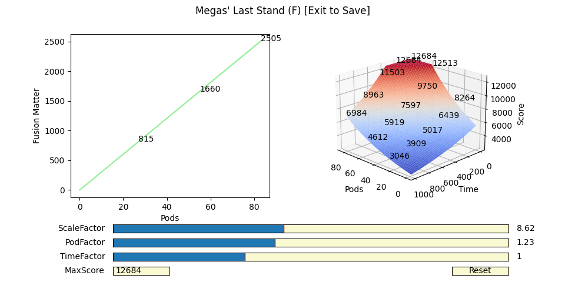

# The Authentic Infected Zone Race Calculations for FusionFall

The following are likely the formulae used from September 24th, 2009 and onwards in the original FusionFall game for racing calculations (some values changed slightly on October 5th, 2009; but the formulae were still applicable).

All time measures are in whole seconds. $\lfloor\cdot\rfloor$ is the floor operator, i.e. $\lfloor 3.14 \rfloor = 3$ and $\lfloor 2.718 \rfloor = 2$. The exponential function is $\exp(x) = e^x$ where $e=2.718...$ is Euler's number.

## Race Score Formula

$$\mathtt{Score} = \min\left(\mathtt{MaxScore}, \left\lfloor \exp\left(\mathtt{PodFactor}\cdot\frac{\mathtt{PodsCollected}}{\mathtt{MaxPods}} - \mathtt{TimeFactor}\cdot\frac{\mathtt{TimeElapsed}}{\mathtt{MaxTime}} + \mathtt{ScaleFactor}\right) \right\rfloor \right)$$

## Fusion Matter Reward Formula

$$\mathtt{FusionMatterReward} = \left\lfloor \frac{1 + \exp(\mathtt{ScaleFactor} - 1)\cdot\mathtt{PodFactor}\cdot\mathtt{PodsCollected}}{\mathtt{MaxPods}} \right\rfloor$$

## Race CRATE Reward Formula

$$\mathtt{CRATEReward} = \begin{cases}
\mathtt{GoldCRATE} & if \quad \mathtt{Score} \geq \lfloor 0.80 \cdot \mathtt{MaxScore} \rfloor \\
\mathtt{SilverCRATE} & if \quad \lfloor 0.70 \cdot \mathtt{MaxScore} \rfloor \leq \mathtt{Score} < \lfloor 0.80 \cdot \mathtt{MaxScore} \rfloor \\
\mathtt{BronzeCRATE} & if \quad \lfloor 0.50 \cdot \mathtt{MaxScore} \rfloor \leq \mathtt{Score} < \lfloor 0.70 \cdot \mathtt{MaxScore} \rfloor \\
\mathtt{NoCRATE} & if \quad \mathtt{Score} < \lfloor 0.50 \cdot \mathtt{MaxScore} \rfloor
\end{cases}$$

Technically there exists Standard CRATE-looking Race CRATEs in the game, but no iteration of FusionFall actually used them.

## Race Star Formula

$$\mathtt{NumberOfStars} = \begin{cases}
5 & if \quad \mathtt{Score} \geq \lfloor 0.80 \cdot \mathtt{MaxScore} \rfloor \\
4 & if \quad \lfloor 0.70 \cdot \mathtt{MaxScore} \rfloor \leq \mathtt{Score} < \lfloor 0.80 \cdot \mathtt{MaxScore} \rfloor \\
3 & if \quad \lfloor 0.50 \cdot \mathtt{MaxScore} \rfloor \leq \mathtt{Score} < \lfloor 0.70 \cdot \mathtt{MaxScore} \rfloor  \\
2 & if \quad \lfloor 0.30 \cdot \mathtt{MaxScore} \rfloor \leq \mathtt{Score} < \lfloor 0.50 \cdot \mathtt{MaxScore} \rfloor  \\
1 & if \quad \lfloor 0.29 \cdot \mathtt{MaxScore} \rfloor \leq \mathtt{Score} < \lfloor 0.30 \cdot \mathtt{MaxScore} \rfloor  \\
0 & if \quad \mathtt{Score} < \lfloor 0.29 \cdot \mathtt{MaxScore} \rfloor
\end{cases}$$

## Definition Table (October 5th, 2009 and Onward)

| Infected Zone Name          | MaxScore | MaxPods | MaxTime | ScaleFactor  | PodFactor   | TimeFactor |
|-----------------------------|----------|---------|---------|--------------|-------------|------------|
| KND Training Area (F)       | 777      | 14      | 150     | 5.644393282  | 1.2         | 1.0        |
| Pokey Oaks Junior High (F)  | 4542     | 38      | 430^    | 7.591673579  | 1.2         | 1.0        |
| Mandark's House (F)         | 2611     | 26      | 192     | 7.037870159  | 1.2         | 1.0        |
| Delightful Developments (F) | 7373     | 62      | 590     | 8.076653705  | 1.2         | 1.0        |
| Megas' Last Stand (F)       | 12684    | 83      | 982     | 8.619724357  | 1.229629216 | 1.0        |
| Pokey Oaks Junior High      | 11563    | 103     | 647     | 8.526717769  | 1.2         | 1.0        |
| Mandark's House             | 7597     | 88      | 507     | 8.106606527  | 1.2         | 1.0        |
| Sweet Revenge               | 4463     | 53      | 300     | 7.573667870  | 1.223089738 | 1.0        |
| Delightful Developments     | 7639     | 64      | 425     | 8.113141933  | 1.2         | 1.0        |
| Megas' Last Stand           | 15500    | 137     | 1030    | 8.798112624  | 1.2         | 1.0        |
| The Boneyard                | 19598    | 128     | 1277    | 9.055157699  | 1.2         | 1.0        |
| Reactor Works               | 27500    | 132     | 1537    | 9.330381898  | 1.2         | 1.0        |
| Charles Darwin Middle School| 14500    | 76      | 682     | 8.647786952  | 1.2         | 1.0        |
| Dizzy World                 | 17017    | 122     | 705     | 8.913522031  | 1.262065227 | 1.0        |
| Sunny Bridges Auditorium    | 12711    | 97      | 685     | 8.621194041  | 1.2         | 1.0        |
| Jungle Training Area        | 10500    | 84      | 575     | 8.382126017  | 1.2         | 1.0        |
| Loch Mess                   | 8000     | 53      | 367^    | 8.113139367  | 1.2         | 1.0        |
| The Fissure                 | 17895    | 115     | 677     | 8.964503344  | 1.2         | 1.0        |
| Cutts and Bruises Skate Park| 9032     | 49      | 347     | 8.280693579  | 1.2         | 1.0        |
| Sand Castle                 | 27500    | 156     | 1257    | 9.367066898  | 1.2         | 1.0        |
| Crystalline Caverns         | 11000    | 50      | 702     | 8.401840829  | 1.2         | 1.0        |
| Construction Site           | 24941    | 81      | 1082    | 9.295800243  | 1.2         | 1.0        |
| Hani-Baba Temple            | 22000    | 69      | 825     | 9.133000407  | 1.2         | 1.0        |
| Tyrannical Gardens          | 46758    | 123     | 1590    | 9.924523256  | 1.2         | 1.0        |
| Skypad Space Port           | 37098    | 220     | 1750    | 9.693329363  | 1.760001111 | 1.0        |
| Nowhere Triangle            | 25500    | 97      | 640     | 9.297791938  | 1.2         | 1.0        |
| The Canopy                  | 32706    | 75      | 1167    | 9.567316196  | 1.2         | 1.0        |
| Monkey Summit               | 45949    | 59      | 925     | 9.907205558  | 1.2         | 1.0        |
| Dinosaur Graveyard          | 20000    | 87      | 587     | 9.03301301   | 1.21394926  | 1.0        |
| Inferno Fields              | 70835    | 89      | 1370    | 10.33969929  | 1.241862966 | 1.0        |
| Dark Tree Clearing          | 66000    | 168     | 1372    | 10.268042998 | 1.207185646 | 1.0        |
| Green Gullet                | 49101    | 74      | 652     | 9.972844398  | 1.2         | 1.0        |

The values annotated with `^` are derived values without video or scraped evidence (such that the time factor resolves to `1.0` exactly). The supporting evidence is, similar to other time limits, their last digits are 0 and 7 respectively, and +/- one second would make enough of a difference to change the time factor.

## Older Definition Table (from September 24th, 2009 till October 5th, 2009)

| Infected Zone Name          | MaxScore | MaxPods | MaxTime | ScaleFactor  | PodFactor   | TimeFactor |
|-----------------------------|----------|---------|---------|--------------|-------------|------------|
| KND Training Area (F)       | 649      | 14      | 165     | 5.644393282  | 1.2         | 1.0        |
| Megas' Last Stand           | 15158*   | 137     | 1030    | 8.798112624  | 1.2         | 1.0        |
| Loch Mess                   | 7647*    | 53      | 367^    | 8.113139367  | 1.2         | 1.0        |
| Sand Castle                 | 26775    | 156     | 1257    | 9.367066898  | 1.2         | 1.0        |
| Dinosaur Graveyard          | 19180    | 87      | 587     | 9.03301301   | 1.21394926  | 1.0        |

The values annotated with `*` are uncertain due them having a single legitimate record. Still, they are from very prolific racers, so it is conceivable that they have reached the available maximum score at the time. The changelog from October 5th, 2009 states that the timer and the maximum score has been adjusted for KND Training Area, and some other Infected Zones had their maximum scores increased, which supports the values discovered here.

That said, it is also possible that more Infected Zones than listed here were subject to a maximum score change. There is no evidence for or against this possibility at this time.

# The Discovery Process

If you care about the details of the discoveries made here, please read [DISCOVERY.md](DISCOVERY.md).

# How to Edit the Score Functions?

Use `export_config.py` to export a patch that can be put inside `tdata/patch` and then loaded by an [OpenFusion](https://github.com/OpenFusionProject/OpenFusion) server. This script lets you go over the configurations for each Infected Zone and edit them through sliders. The default output of this script is present in `data/ogracingpatch`.

# Useful Data

In this repository, you can find the following in the `data/` directory, which you may use freely for any projects you have:
- `ogracingpatch/` directory: This can directly be copied inside the `tdata/patch` directory of your [OpenFusion](https://github.com/OpenFusionProject/OpenFusion) server, and then by editing `config.ini`, you can load and use the above racing functions on your server.
- `score_yt.json`: A collection of scores that date back to the original game, evidenced by YouTube videos, grouped by Infected Zone. The `yt` key in objects refers to a unique YouTube tag. For example, if the value is `fEzZjF4bn4A`, you can find the YouTube video at the link https://youtu.be/fEzZjF4bn4A or https://www.youtube.com/watch?v=fEzZjF4bn4A. The links are valid as of June 2023. Videos dating back further than the September 24th, 2009 update have keys like `og_score` and `og_fm`. These refer to the original values seen on screen, whereas `score` and `fm` for these videos have been backfilled by the discovered formula using `og_score_fix.py` (they were excluded from the discovery process for obvious reasons). The backfilled values are nonetheless considered invalid because some Infected Zones had different pods to collect, different time limits and different maximum scores before the September 24th, 2009 update.
- `searcher.py` and `wayback.py`: These were used to scrape and search all reachable FusionFall pages as of June 2023. You shouldn't re-scrape the Wayback Machine for most cases, since you can download all the pages [here](https://drive.google.com/file/d/1AfwtyQMBJzqzW1Koc9KCtvwWiYpVu5p3/view?usp=sharing). You can use `searcher.py` to do some basic keyword search on pages, and explore these pages locally to find something. You'll need to edit these two files to search for terms and/or scrape more pages. Even though not all of them are unique, there are some 16,000+ scraped pages, hence why the `ffpages/` directory was excluded from this repository.
- `fake_leaderboard.json` and `raw_leaderboard.json`: These are products of running `leaderboard_scrape.py`, and they contain scores with pod and time information from the player leaderboard page on FusionFall's official website, accessed through scraped pages. The fake leaderboard contains all the placeholder values put in place when some player's page did not have enough races to display, mostly here for fun and documentation. The raw leaderboard contains values that are genuine, and all values here are guaranteed to be races after the September 24th, 2009 update. Both leaderboards are grouped by Infected Zone, and races recorded contain fields that indicate the score, time elapsed, pods collected, the racing player and the timestamp at which the web page was scraped for this information (The players in the fake leaderboard obviously don't exist).
- `manual_split.py` and the `splits/` directory: Using `raw_leaderboard.json`, the best (and only) way to know which races took place after the October 5th, 2009 update is to manually inspect the scores. When filtered through the number of pods collected, and sorted by time elapsed, the races between September 24th and October 5th are visible outliers, and `manual_split.py` helps you separate these into Infected Zone-specific files inside the `splits/` directory.
- `leaderboard.json`: Use this if you need a refined view of all scores scraped. Another product of running `leaderboard_scrape.py`, which uses `raw_leaderboard.json` and the files inside the `splits/` directory (provided by `manual_split.py`) to separate Infected Zone scores into `(Old)` (races between September 24th and October 5th, 2009) and `(New)` (races after October 5th, 2009) entries. As such, all scores inside this leaderboard are valid inlier scores (i.e. no longer "raw").
- `limits.json`: Contains useful information specific to Infected Zones, like maximum score, maximum number of pods available, time limit, the Infected Zone ID and the area level. Some Infected Zones here are also grouped `(Old)` and `(New)` as some of these values were changed after the October 5th, 2009 update. Another product of running `leaderboard_scrape.py`.
- `merged_scores.json`: Contains all usable information on races in the original game as of June 2023, from YouTube and Wayback Machine sources. Generated by `leaderboard_scrape.py` as a final product by merging `limits.json`, `leaderboard.json` and `score_yt.json`.
- `params.json` and `params.csv`: Contains the final discoveries for the scale factor, pod factor and time factor.
- `nopod/` directory: Contains scores and tools for an earlier, more manual attempt at score scraping before the player leaderboard page was discovered. The scores here come from YouTube videos (`scores_yt.json` is still more correct and complete) and a manual copy-paste through the score leaderboards that did not contain pod or time information. The entries contain many duplicates, but it might be useful for a future project.

# Dependencies

- [Julia](https://julialang.org/), [PySR](https://github.com/MilesCranmer/PySR) and [SymPy](https://www.sympy.org/en/index.html) for the symbolic regression components inside `score_search.py`, `fm_search.py` and `param_search.py`.
- [PyTorch](https://pytorch.org/) for the gradient-based optimizations of certain formulae in `score_torch.py` and `fm_torch.py`.
- [Scikit-Learn](https://scikit-learn.org/stable/) for the simple regression and feature extraction attempts in `viz.py`.
- [NumPy](https://numpy.org/) and [Matplotlib](https://matplotlib.org/) for pretty much everything in the project.
- [IPython](https://ipython.org/notebook.html) for experimentation and the ability to stop long running symbolic regression jobs at will.

# Acknowledgements

This project wouldn't have been possible without the racers of FusionFall, especially those who recorded and uploaded their races. Also special thanks to [OpenFusionProject](https://github.com/OpenFusionProject) contributors for their support and suggestions.

# Contributing

Please open a Pull Request with a description for your code contributions. You are welcome to discuss problems and potential improvements in the Issues section.
